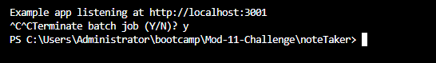

# Note Taker

## Descriptoin

A backend project that I made that utilizes express js to send and retrieve data from a JSON file. I use express to redirect routes for each html page using get requests. I also use GET / POST requests to send and retrieve the data from the api. In the directory db, you will see the json file that holds all of the data. You are also able to delete data using a DELETE request. I use fs to read and write to the json file. For each id of the json objects, I used the npm uuid package.  

 ## Installation

Make sure to have node js installed. I used the recommended version which is 20.10.0 LTS as of now. After installed, in the terminal type "npm install -y" and hit enter. This should install the express and uuid packages. After type "npm start" and this should now be running on the localhost. Don't forget to terminate process once you are done. Use ctrl c to exit.

Link to node js: https://nodejs.org/en/

## Screenshots

### What to do in Terminal:

### Now go to local host:

#### This should take you to your local host: http://localhost:3001/ 

### HTML Pages:

### Terminate process: 

## Deployment

### Hosted on heroku (for now), here's the link: 

https://rocky-woodland-73943-3baf9e75b39d.herokuapp.com/

## License

